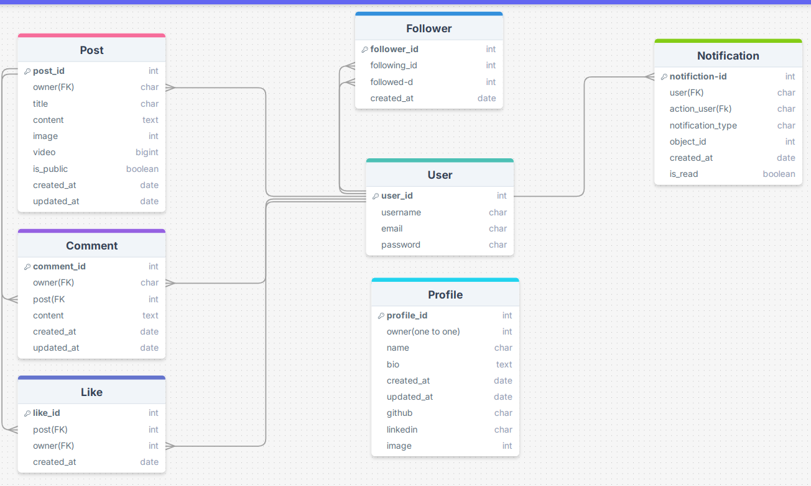
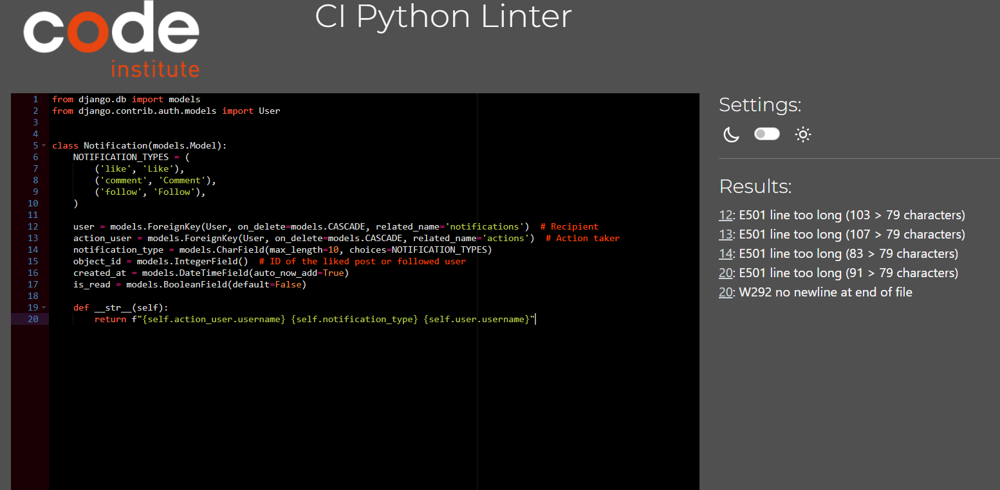
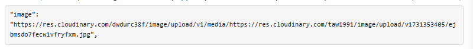
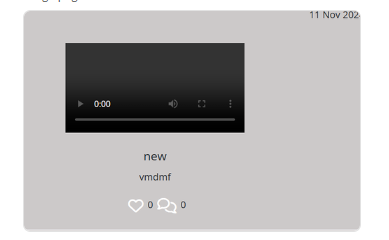

# Afghanspher

## Project goals
This project provides a Django Rest Framework API for the [Afghansphere React web app](https://github.com/LimaZurmati/afghansphere1). 

The Afghansphere project aims to be a vibrant platform that not only showcases Afghanistan's natural beauty and historical significance but also serves as a community-driven space for sharing personal experiences and cultural pride. By engaging both locals and visitors, the project can promote a deeper understanding and appreciation of Afghanistan's unique heritage.
1) Showcase Afghanistan's Best Places:
Highlight Scenic and Historical Sites: Feature beautiful landscapes, historical landmarks, and cultural heritage sites, such as the Buddhas of Bamiyan, the Minaret of Jam, and the ancient city of Herat.
User-Contributed Content: Allow users to submit their recommendations for must-visit places, including detailed descriptions, photos, and personal stories.
2) Cultural Sharing:
Experience Sharing: Create a space where Afghan people can share their personal experiences and anecdotes related to specific locations, enhancing cultural understanding and appreciation.
Vibrant Community Interaction: Foster discussions through comments and forums where users can connect over shared experiences and insights.

## Table of contents
- [Afghansphere](#afghanshpere)
  * [Table of contents](#table-of-contents)
  * [ Database Designs](#database-design)
  * [API endpoints](#api-endpoints)
  * [Frameworks, libraries and dependencies](#frameworks--libraries-and-dependencies)
    + [django-cloudinary-storage](#django-cloudinary-storage)
    + [dj-allauth](#dj-allauth)
    + [dj-rest-auth](#dj-rest-auth)
    + [djangorestframework-simplejwt](#djangorestframework-simplejwt)
    + [dj-database-url](#dj-database-url)
    + [psychopg2](#psychopg2)
    + [python-dateutil](#python-dateutil)
    + [django-recurrence](#django-recurrence)
    + [django-filter](#django-filter)
    + [django-cors-headers](#django-cors-headers)
  * [Testing](#testing)
    + [Manual testing](#manual-testing)
    + [Automated tests](#automated-tests)
    + [Python validation](#python-validation)
    + [Resolved bugs](#resolved-bugs)
      - [Bugs found while testing the API in isolation](#bugs-found-while-testing-the-api-in-isolation)
      - [Bugs found while testing the React front-end](#bugs-found-while-testing-the-react-front-end)
    + [Unresolved bugs](#unresolved-bugs)
  * [Deployment](#deployment)
  * [Credits](#credits)

### Database Designs

The following Entity Relationship Diagram illustrates the models utilized in the project. The built-in Django User model serves as the foundation, and the following custom models have been developed:

1. Profiles (a modified version of the standard Django User model)
2. Posts (for publishing text-based content)
3. Comments (to allow users to comment on posts and engage with the community)
4. Likes (to indicate interest in content)
5.Notifications (to alert users about relevant activities and interactions)

      Note: I was planning to include a notification feature in my app that would allow users to post notifications or receive updates. I created a data model for this, but unfortunately, due to unforeseen issues, I wasn't able to implement this feature. Further clarification can be found at the end of the document.

### _Database Schema_
The relationships between all of these models is summarized in the followed entity relationship diagram:

## API Endpoints

| **URL**                      | **Notes**                                                                                                                         | **HTTP Method** | **CRUD Operation** | **View Type** | **POST/PUT Data Format**                                                                                                       |
|------------------------------|-----------------------------------------------------------------------------------------------------------------------------------|------------------|-------------------|----------------|-------------------------------------------------------------------------------------------------------------------------------|
| **Custom User Account Endpoints** |                                                                                                                                   |                  |                   |                |                                                                                                                               |
| /accounts/afghansphere       | Handles creation of a new user account with 'tribe' admin permissions, creating a new user profile and a new tribe attached.   | POST             | Create            | List           | {     "username": "string",     "password": "string",     "password2": "string",     "tribename": "string" } |
| /accounts/user               | Only tribe admins can use this endpoint. Handles creation of a new user account without tribe admin permissions.                   | POST             | Create            | List           | {     "username": "string",     "password": "string",     "password2": "string" }                                 |
| /accounts/user/{id}         | Handles deletion of the specified user account and profile. Only tribe admins can delete associated users and tribes.              | DELETE           | Delete            | Detail         | N/A                                                                                                                           |
| **Profiles Endpoints**       |                                                                                                                                   |                  |                   |                |                                                                                                                               |
| /profiles/{id}               | Retrieves profile details for the specified user. Only members of the same tribe can access this data.                           | GET              | Read              | Detail         | N/A                                                                                                                           |
| /profiles/{id}               | Updates existing user profiles. This can only be done by the profile owner or the admin of the user's tribe.                      | PUT              | Update            | Detail         | {     "display_name": "string",     "image": "string",     "is_admin": bool }  Plus image data            |
| **Posts Endpoints**          |                                                                                                                                   |                  |                   |                |                                                                                                                               |
| /posts                       | Lists all posts made by the authenticated user or all posts in the community.                                                    | GET              | Read              | List           | N/A                                                                                                                           |
| /posts                       | Creates a new post for the authenticated user.                                                                                   | POST             | Create            | List           | {     "title": "string",     "content": "string" }                                                                    |
| /posts/{id}                 | Retrieves details of a specific post.                                                                                            | GET              | Read              | Detail         | N/A                                                                                                                           |
| /posts/{id}                 | Updates an existing post. This can only be done by the post's author.                                                            | PUT              | Update            | Detail         | {     "title": "string",     "content": "string" }                                                                    |
| /posts/{id}                 | Deletes the specified post. Only the author or an admin can perform this action.                                                | DELETE           | Delete            | Detail         | N/A                                                                                                                           |
| **Comments Endpoints**       |                                                                                                                                   |                  |                   |                |                                                                                                                               |
| /posts/{post_id}/comments    | Lists all comments for a specific post.                                                                                         | GET              | Read              | List           | N/A                                                                                                                           |
| /posts/{post_id}/comments    | Creates a new comment on a specific post for the authenticated user.                                                             | POST             | Create            | List           | {     "content": "string" }                                                                                             |
| /comments/{id}               | Retrieves details of a specific comment.                                                                                         | GET              | Read              | Detail         | N/A                                                                                                                           |
| /comments/{id}               | Updates an existing comment. This can only be done by the comment's author.                                                      | PUT              | Update            | Detail         | {     "content": "string" }                                                                                             |
| /comments/{id}               | Deletes the specified comment. Only the author can perform this action.                                                           | DELETE           | Delete            | Detail         | N/A                                                                                                                           |
| **Likes Endpoints**          |                                                                                                                                   |                  |                   |                |                                                                                                                               |
| /posts/{post_id}/likes       | Lists all likes for a specific post.                                                                                             | GET              | Read              | List           | N/A                                                                                                                           |
| /posts/{post_id}/likes       | Allows the authenticated user to like a specific post.                                                                           | POST             | Create            | List           | N/A                                                                                                                           |
| /posts/{post_id}/likes/{id}  | Allows the authenticated user to unlike a specific post.                                                                         | DELETE           | Delete            | Detail         | N/A                                                                                                                           |
| **Notification Endpoints**    |                                                                                                                                   |                  |                   |                |                                                                                                                               |
| /notifications                | Lists all notifications for the authenticated user.                                                                             | GET              | Read              | List           | N/A                                                                                                                           |
| /notifications/{id}          | Deletes the specified notification. Only the owner of the notification can perform this action.                                   | DELETE           | Delete            | Detail         | N/A                                                                                                                           |

## Frameworks, libraries and dependencies
The TribeHub API is implemented in Python using [Django](https://www.djangoproject.com) and [Django Rest Framework](https://django-filter.readthedocs.io/en/stable/).

The following additional utilities, apps and modules were also used.

### django-cloudinary-storage
https://pypi.org/project/django-cloudinary-storage/

Facilitates the integration of Cloudinary for storing user profile images.

### dj-allauth
https://django-allauth.readthedocs.io/en/latest/

This package is designed for user authentication. Although it is not currently in use, it allows for registration and authentication through various social media accounts, with the potential for implementation in a future update.

### dj-rest-auth
https://dj-rest-auth.readthedocs.io/en/latest/introduction.html

Offers REST API endpoints for logging in and out. 

### djangorestframework-simplejwt
https://django-rest-framework-simplejwt.readthedocs.io/en/latest/

Provides JSON web token authentication.

### dj-database-url
https://pypi.org/project/dj-database-url/

Creates an environment variable to configure the connection to the database.

### psychopg2
https://pypi.org/project/psycopg2/

Database adapater to enable interaction between Python and the PostgreSQL database.

### python-dateutil
https://pypi.org/project/python-dateutil/

This module provides extensions to the standard Python datetime module. It is a pre-requisite for django-recurrence library.
 
### django-filter
https://django-filter.readthedocs.io/en/stable/

### django-cors-headers
https://pypi.org/project/django-cors-headers/

This Django app adds Cross-Origin-Resource Sharing (CORS) headers to responses, to enable the API to respond to requests from origins other than its own host.

### PostgreSQL: PostgreSQL was used as the object-relational database system.

### ElephantSQL: ElephantSQL was used to host the database.
### Cloudinary: A service that hosts image files in the project.

### Git: Git was used for version control by utilizing the Gitpod terminal to commit to Git and Push to GitHub.

### GitHub: GitHub is used to store the projects code after being pushed from Git.

### CI Python Linter: was used to validate the Python code in this project
### Heroku: Heroku was used for the deployed application.

### DrawSQLapp: Development of database schema.

## Testing

### _A. Python Testing_

[CI Python Linter](https://pep8ci.herokuapp.com/) was used to validate the Python code in this project. All code passed without errors, except some files which showed `E501 'line too long'` warnings.

- `posts/admin.py`: no errors found
- `posts/models.py`: no errors found
- `posts/tests.py`: no errors found
- `posts/serializers.py`: no errors found
- `posts/urls.py`: no errors found
- `posts/views.py`: no errors found

- `profiles/admin.py`: no errors found
- `profiles/models.py`: no errors found
- `profiles/serializers.py`: no errors found
- `profiles/urls.py`: no errors found
- `profiles/views.py`: no errors found

- `notifications/admin.py`: no errors found
- `notifications/models.py`: no errors found
- `notifications/serializers.py`: no errors found
- `notifications/urls.py`: no errors found
- `notifications/views.py`:no errors found

- `profiles/admin.py`: no errors found
- `profiles/models.py`: no errors found
- `profiles/serializers.py`: no errors found
- `profiles/urls.py`: no errors found
- `profiles/views.py`: no errors found  

- `likes/serializers.py`: no errors found
- `likes/models.py`: no errors found
- `likes/urls.py`: no errors found  
- `likes/views.py`: no errors found
- `likes/serializers.py`: no errors found

- `followers/admin.py`: no errors found
- `followers/models.py`: no errors found
- `tribes/serializers.py`: no errors found
- `followers/urls.py`: no errors found
- `followers/views.py`: no errors found

- `comments/admin.py`: no errors found
- `comments/models.py`: no errors found
- `comments/serializers.py`: no errors found
- `comments/urls.py`: no errors found
- `comments/views.py`: no errors found

- `afghnistan_api/admin.py`: no errors found
- `afghnistan_api/permission.py`: no errors found
- `afghnistan_api/serializers.py`: no errors found
- `afghnistan_api/setting.py`: no errors found
- `afghnistan_api/urls.py`: no errors found
- `afghnistan_api/views.py`: no errors found

### _C. Manual Testing_

Throughout the development process, manual testing got CRUD testing was done to make sure the database was being updated as intended whether adding, reading, updating, or removing data as needed. All apps function properly.

**Prfiles App**

* List View: Accessible for reading if logged in.
* List View: Accessible for reading if not logged in.
* Detail View: Allows reading and updating if the user is the owner.
* Detail View: Allows reading if the user is not the owner.
* Detail View: Allows reading if not logged in.

**Followers App**
* List View: Allows reading and creating if logged in.
* List View: Accessible for reading if not logged in.
* Detail View: Allows reading and deleting if the user is the owner.
* Detail View: Allows reading if the user is not the owner.
* Detail View: Allows reading if not logged in.

**Posts App**
* List View (Read, Create if logged in)
* List View (Read if not logged in)
* Detail View (Read, Update, Delete if owner)
* Detail View (Read if not owner)
* Detail View (Read if not logged in)

**Likes App**
* List View (Read, Create if logged in)
* List View (Read if not logged in)
* Detail View (Read, Delete if owner)
* Detail View (Read if not owner)
* Detail View (Read if not logged in)

**Comments App**
* List View (Read, Create if logged in)
* List View (Read if not logged in)
* Detail View (Read, Update, Delete if owner)
* Detail View (Read if not owner)
* Detail View (Read if not logged in)

**Notifications**
* List View: Displays notifications for the logged-in user.
* Detail View: Allows reading and deleting notifications if the user is the owner.

## Bugs
### _A. Solved Bugs_

 1. While creating to add **Video** When I upload image or video in my app it uploaded successfully in cloudianry but does not shows in preview,it displayed 2 urls.
 
  

 I  use this package:
https://pypi.org/project/django-cloudinary-storage/

### _B. Unfixed Bugs_
So far none

## Deployment

- Log in to Heroku.
- Select 'Create new app' from the 'New' menu at the top right.
- Enter a name for the app and select the appropriate region.
- Select 'Create app'.
- Select the 'settings' tab.
- Locate the 'reveal config vars' link and select.
- Enter the following config var names and values:
    - `CLOUDINARY_URL`: *your cloudinary URL as obtained above*
    - `DATABASE_URL`: *your ElephantSQL postgres database URL as obtained above*
    - `SECRET_KEY`: *your secret key*
    - `ALLOWED_HOST`: *the url of your Heroku app (but without the `https://` prefix)*
- Select the 'Deploy' tab at the top.
- Select 'GitHub' from the deployment options and confirm you wish to deploy using GitHub.
- Find the 'Connect to GitHub' section and use the search box to locate your repo.
- Select 'Connect' when found.
- Optionally choose the main branch under 'Automatic Deploys' and select 'Enable Automatic Deploys' if you wish your deployed API to be automatically redeployed every time you push changes to GitHub.
- Find the 'Manual Deploy' section, choose 'main' as the branch to deploy and select 'Deploy Branch'.
- Your API will shortly be deployed and you will be given a link to the deployed site when the process is complete.

## Credits

* The Code Institute DRF-API walkthrough was used as an invaluable guide on how to build a DRF-API.
* Out ***Tutor Support*** team, Thomas and Oisin, they were always there for me. they assisted me and inspired me with their constant assistance. 
* Stack Overflow: When I faced an issue with my app, the first thing I did was search StackOverflow to try and find a solution to the problem.
- [Django documentation](https://www.djangoproject.com)
- [Django Rest Framework documentation](https://www.django-rest-framework.org)